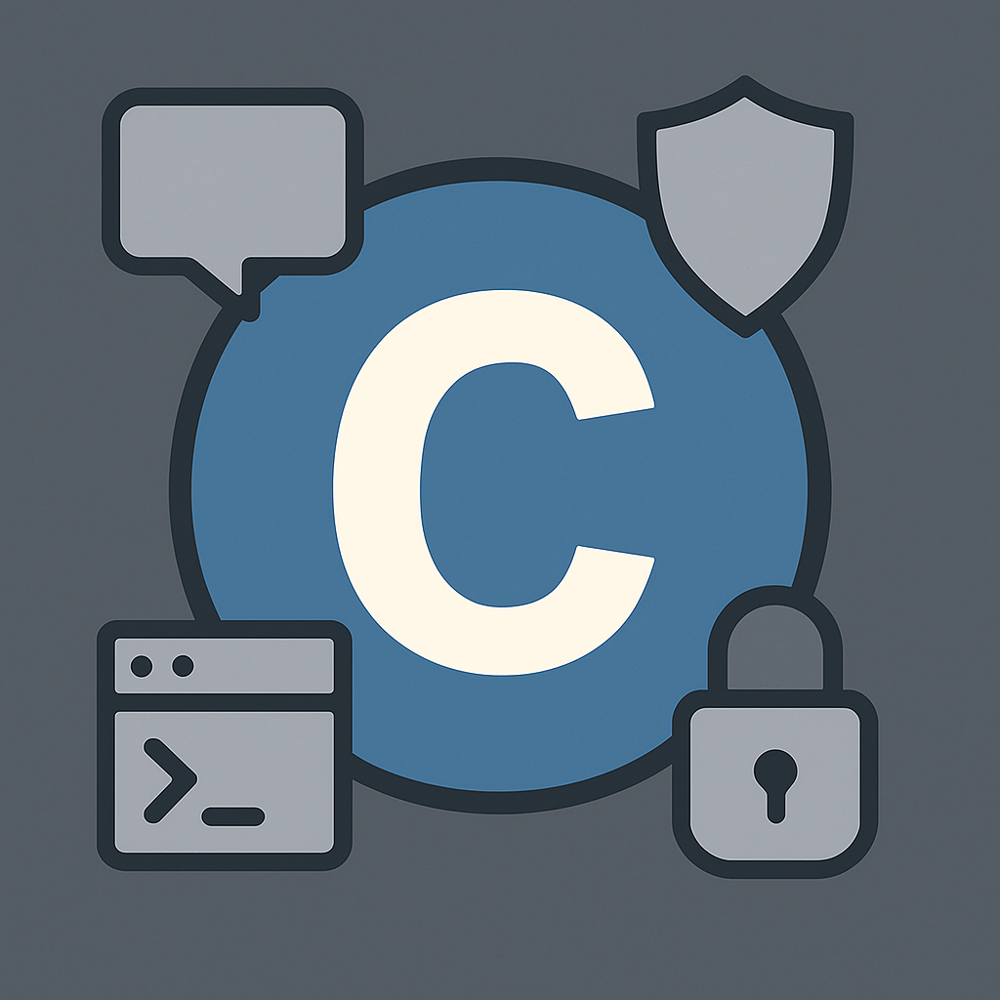

<p align="center">
  
</p>

<p align="center">
  <a href="https://github.com/dunamismax/c-chat">
    
  </a>
</p>

<p align="center">
  <a href="https://clang.llvm.org/"></a>
  <a href="https://libsodium.gitbook.io/doc/"></a>
  <a href="https://developer.apple.com/documentation/apple-silicon"></a>
  <a href="https://opensource.org/licenses/MIT"></a>
  <a href="https://github.com/dunamismax/c-chat/pulls"></a>
  <a href="https://github.com/dunamismax/c-chat/stargazers"></a>
</p>

---

## About This Project

An **end-to-end encrypted command-line chat application** built in pure C with strong security features. C-Chat provides secure private messaging with cryptographically strong encryption, secure key management, zero-knowledge server architecture, and real-time message delivery.

**Key Features:**

- **End-to-End Encryption**: ChaCha20-Poly1305 encryption via libsodium with forward secrecy
- **TCP Server**: Multi-threaded server supporting 1000+ concurrent connections
- **Real-Time Messaging**: Instant encrypted message delivery with offline message queuing
- **Zero-Knowledge Architecture**: Server never accesses plaintext messages or private keys
- **Secure Key Management**: Argon2-based password encryption for local private key storage
- **Memory Safety**: Comprehensive buffer overflow protection and secure memory clearing
- **Rate Limiting**: DoS protection and connection management
- **ARM64 Optimized**: Apple Silicon-specific optimizations with parallel builds and LTO
- **Cross-Platform**: Support for macOS, Linux, and BSD systems
- **CLI Interface**: Terminal-based interface for focused conversations

---

## Quick Start

### Prerequisites

**Required Dependencies:**

```bash
# macOS (Primary Platform)
xcode-select --install
brew install libsodium

# Ubuntu/Debian
sudo apt-get install build-essential clang make libsodium-dev

# Fedora/RHEL
sudo dnf install clang make libsodium-devel

# Optional development tools
brew install clang-format llvm    # macOS
```

### Installation & Setup

```bash
# Clone repository
git clone https://github.com/dunamismax/c-chat.git
cd c-chat

# Build client and server
make                          # Release mode (default)
make MODE=debug              # Debug with sanitizers
make MODE=profile            # Profile build

# Verify installation
./build/release/bin/c-chat --version
make test                    # Run test suite
```

### Server Setup

```bash
# Start the C-Chat server
make run-server

# Or manually
cd server && ./start-server.sh
```

The server will start on `localhost:8080` and handle client connections.

### First Time Usage

```bash
# Register a new user account (connects to server)
./build/release/bin/c-chat --register alice

# Login to start chatting (real server communication)
./build/release/bin/c-chat --login alice

# List registered users (from server)
./build/release/bin/c-chat --list-users
```

---

## Usage Guide

### Account Management

```bash
# Register new user (generates cryptographic keys and registers with server)
c-chat --register <username>    # Creates ~/.c-chat/<username>.keys

# Login to your account (decrypts your private key and authenticates with server)
c-chat --login <username>       # Prompts for password

# View registered users (retrieves from server)
c-chat --list-users            # Shows available users and their online status
```

### Secure Chat Commands

Once logged in, use these commands in the chat interface:

```bash
# Start encrypted chat session (retrieves partner's public key from server)
chat <username>                # Begin secure messaging

# In-chat commands
/exit                         # Leave current chat session
/quit                         # Exit c-chat application
```

---

## Build System

Cross-platform Makefile with ARM64 optimization and development tools.

### Core Commands

```bash
# Building
make                       # Build client and server (release mode)
make c-chat               # Build client only
make server               # Build server only
make test                 # Build and run tests
make clean                # Clean all build artifacts

# Server Operations
make run-server           # Start C-Chat server
make install             # Install to /usr/local

# Development
make MODE=debug           # Debug build with sanitizers
make format               # Format code with clang-format
make lint                 # Static analysis with clang-tidy
```

### Optimization Features

- **Apple Silicon**: ARM64-specific optimizations for M-series processors
- **Link-Time Optimization**: Smaller, faster binaries in release builds
- **Parallel Builds**: Automatically uses all CPU cores
- **Cross-Platform**: macOS, Linux, and BSD support
- **Security Hardening**: Stack protection and sanitizers

---

## Security Architecture

### Cryptographic Implementation

**Key Generation & Storage:**

- Curve25519 key pairs via `crypto_box_keypair()`
- Private keys encrypted with Argon2-derived keys from user passwords
- Key files stored with 600 permissions in `~/.c-chat/`
- Public keys stored in server memory only (no persistent storage)

**Message Encryption:**

- ChaCha20-Poly1305 via `crypto_box_seal()` (anonymous encryption)
- Forward secrecy with secure random nonces
- End-to-end encryption (server never sees plaintext)
- Uses libsodium (NaCl) cryptographic library

**Password Security:**

- Argon2 key derivation (memory-hard, side-channel resistant)
- Unique random salt per user
- Passwords never transmitted or stored on server

### Network Security

**Server Protection:**

- Rate limiting (100 requests per minute per client)
- Connection timeouts and resource management
- Input validation on all protocol messages
- Protection against buffer overflow and injection attacks

**Communication Security:**

- Custom binary protocol over TCP
- Message authentication and integrity verification
- Graceful connection handling and recovery
- Secure cleanup of sensitive server state

### Privacy Features

**Zero-Knowledge Server:**

- Server never stores or logs message content
- Minimal metadata collection (usernames and online status only)
- No persistent storage of user data
- Automatic cleanup of sensitive information

**Client Privacy:**

- Private keys never leave the local device
- Secure memory clearing with `sodium_memzero()`
- No plaintext message storage
- Atomic file operations prevent data corruption

---

## Testing & Quality

### Test Suite

```bash
make test                   # Run all tests
make test MODE=debug       # Debug build with sanitizers
make benchmark             # Performance benchmarks
```

**Test Coverage:**

- Cryptographic operations (key generation, encryption/decryption)
- Network protocol implementation and error handling
- Security features (buffer protection, input validation, memory safety)
- Server-client communication and message delivery
- Cross-platform compatibility

### Code Quality

**Tools:**

- **clang-tidy**: Static analysis with security checks
- **AddressSanitizer**: Runtime memory error detection
- **clang-format**: Consistent LLVM-style formatting

**Standards:**

- C11 standard with security-focused practices
- All cryptographic operations use libsodium
- Comprehensive error handling and logging

---

## Project Structure

```sh
c-chat/
├── src/                      # Core client application source
│   ├── main.c               # Application entry point & CLI argument parsing
│   ├── interface.c          # Interactive CLI interface & command handling
│   ├── user.c               # User registration, login & account management
│   ├── chat.c               # Secure chat sessions & message handling
│   ├── crypto.c             # Cryptographic operations (libsodium wrapper)
│   ├── network.c            # Real TCP network communication
│   └── utils.c              # Utility functions & security helpers
├── server/                   # C-Chat server implementation
│   ├── src/                 # Server source files
│   ├── include/            # Server headers
│   ├── Makefile            # Server build system
│   └── start-server.sh     # Server startup script
├── include/                  # Client header files
│   └── c-chat.h            # Main header with all declarations
├── tests/                    # Test suite
│   ├── test_basic.c        # Core functionality tests
│   └── test_network.c      # Network integration tests
├── build/                    # Build artifacts (auto-generated)
│   ├── debug/              # Debug builds with sanitizers
│   ├── release/            # Optimized builds
│   └── profile/            # Profiling builds
├── protocol.md              # Network protocol specification
├── NETWORK_IMPLEMENTATION.md # Detailed network documentation
└── Makefile                 # Cross-platform build system
```

### Technology Stack

- **Language**: C11 with ARM64-specific optimizations
- **Cryptography**: libsodium (NaCl) cryptographic library
- **Networking**: POSIX sockets with custom binary protocol
- **Threading**: pthreads for server concurrency
- **Compiler**: Clang with security hardening flags
- **Build**: Cross-platform Makefile
- **Platforms**: macOS, Linux, BSD

---

## Troubleshooting

### Common Issues

**Build Problems:**

```bash
# libsodium not found
brew install libsodium        # macOS
sudo apt install libsodium-dev  # Ubuntu

# Clean rebuild
make clean && make

# Check dependencies
make sysinfo
```

**Server Issues:**

```bash
# Check if server is running
lsof -i :8080

# View server logs
tail -f server/logs/server-*.log

# Restart server
make run-server
```

**Connection Problems:**

```bash
# Test server connectivity
telnet localhost 8080

# Check firewall settings
# Ensure port 8080 is accessible
```

**Key Issues:**

```bash
# Reset user keys (destroys existing keys)
rm ~/.c-chat/username.keys

# Check key file permissions
ls -la ~/.c-chat/
```

### Performance

**Build Modes:**

- **Release**: Optimized for performance
- **Debug**: Includes sanitizers and debug info

**System Requirements:**

- **Server**: 1-2MB RAM base + 50KB per connected client
- **Client**: 1-2MB RAM during operation
- **Storage**: ~200 bytes per user key file
- **Network**: <10ms latency for local message delivery

---

## Contributing

Contributions welcome! Please ensure security-related changes are thoroughly tested.

### Development Workflow

```bash
# Setup development environment
git clone https://github.com/dunamismax/c-chat.git
cd c-chat
make MODE=debug

# Before submitting PR
make format lint test
```

### Security Guidelines

- Use libsodium for all cryptographic operations
- Securely clear sensitive data after use
- Validate all user-controlled input
- Use bounded string functions for memory safety

---

## License

This project is licensed under the **MIT License** - see the [LICENSE](LICENSE) file for details.

---

## Support This Project

If you find C-Chat valuable for your secure communication needs, consider supporting its continued development:

<p align="center">
  <a href="https://www.buymeacoffee.com/dunamismax" target="_blank">
    
  </a>
</p>

---

## Connect

<p align="center">
  <a href="https://twitter.com/dunamismax" target="_blank"></a>
  <a href="https://bsky.app/profile/dunamismax.bsky.social" target="_blank"></a>
  <a href="https://reddit.com/user/dunamismax" target="_blank"></a>
  <a href="https://discord.com/users/dunamismax" target="_blank"></a>
  <a href="https://signal.me/#p/+dunamismax.66" target="_blank"></a>
</p>

---

<p align="center">
  <strong>Built with Pure C & LibSodium</strong><br>
  <sub>End-to-end encrypted communication for the command line</sub>
</p>
